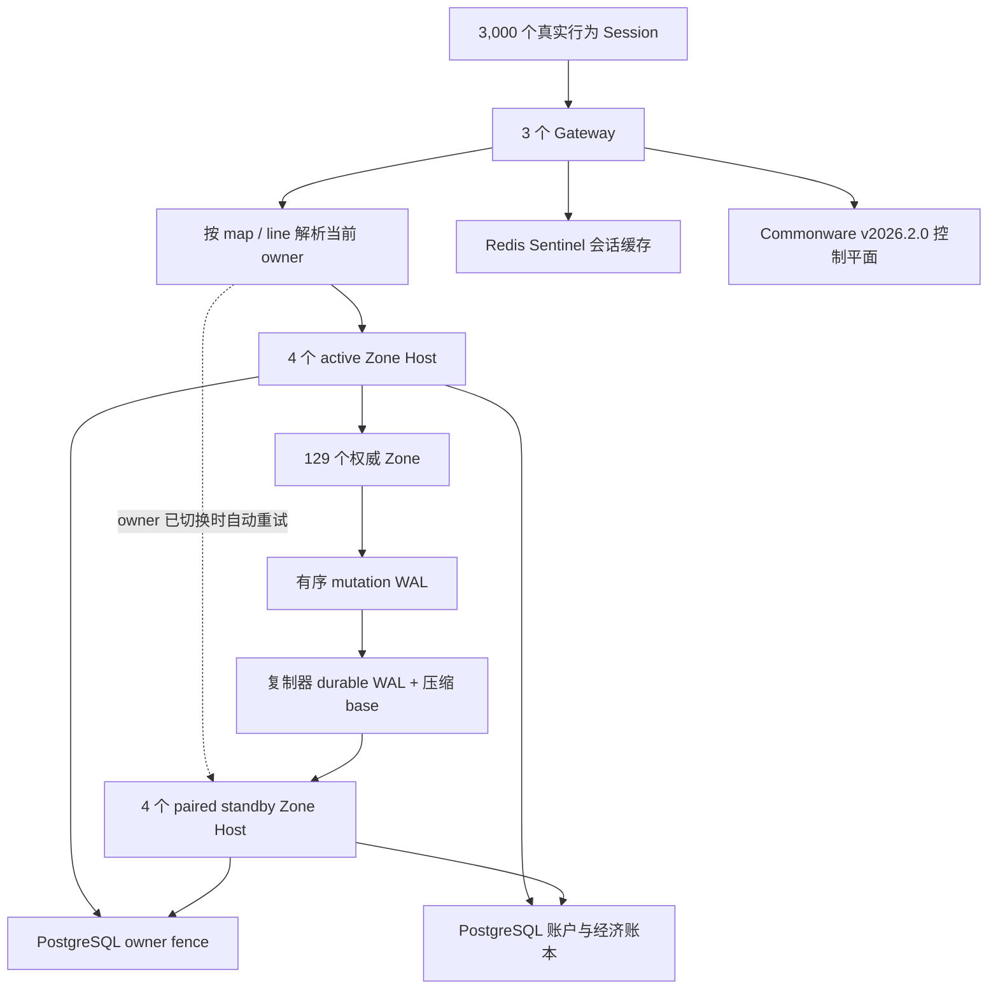

# Gate 21：Regional 3,000 玩家 / 72 小时最终认证

Gate 21 是 Regional 的最终门。它把 Gate 20 已验证的热点地图分线扩展为可持续
运行的区域级部署，并把 Zone 状态从“可复制 checkpoint”升级为：

- 每个 Zone 独立的 v5 压缩 base snapshot；
- base 之后有序、带摘要的 mutation WAL；
- PostgreSQL compare-and-set owner fencing；
- active 故障后，只有精确追平且关闭自主时钟的 standby 才能晋升；
- 复制器重启后从 PostgreSQL 恢复当前 A/B 角色；
- 晋升后的 Session 重新绑定 PostgreSQL 账户存储，继续持久化角色；
- 物理节点 ID、逻辑租约 owner ID 分离，滚动升级不会偷偷改变 owner。

## 认证边界

正式证据必须同时满足：

- 3,000 个不同账号和角色，持续有效负载 `259,200` 秒（72 小时）；
- 120 张真实 Mir2 地图同时活跃；
- 地图 `0` 有 500 人，由热点策略拆成 10 条各 50 人的线路；
- 129 个权威 Zone（119 张普通地图 + 10 条热点线路）；
- 全命令 p95 `<=200ms`、p99 `<=500ms`、错误率 `<=0.1%`；
- Gateway 到 Zone Host 使用 MessagePack 和 256-lane 有界共享连接池；
- 3,000 条 Session 对 Zone Host 的活动连接不超过 260；
- 中途安全 promotion 后，全部目标 Session 刷新 owner 并继续真实命令；
- 稳态参考容器内存增长 `<=5%`；
- durable、未压缩 WAL 的最大占用 `<=1GiB`；
- active/standby Zone、Gateway、Redis、PostgreSQL、Commonware、网络分区和
  滚动升级故障矩阵全部通过；
- 经济重复、运行态/账本偏差、dead letter、负余额和孤儿事务均为 0。

短测只能证明功能路径，不能把 5 分钟结果线性外推成 72 小时认证。

## 架构



一对 Host 可以承载多个 Zone，但副本状态、时钟、WAL、晋升 readiness 和持久化
重绑定都以 Zone 为边界。安装 `map:0` 的只读副本不会改变同进程其他活跃地图的
账户存储配置。副本在晋升前拒绝整个玩家 Session 平面；Gateway 把
`zone_replica_read_only` 当作可重试 owner 路由错误，而不是把旧副本当成可读世界。

## 身份模型

每台物理 Host 有唯一 `MIR2_ZONE_HOST_ID`，用于遥测、容量和运维。A 组四台 Host
共享逻辑租约 owner `gate21-active`，B 组共享 `gate21-standby`：

```text
MIR2_GATEWAY_INSTANCE_ID           = gate21-zone-1   # 物理进程身份
MIR2_GATEWAY_ZONE_LEASE_OWNER_ID   = gate21-active   # 逻辑写者身份
MIR2_ZONE_HOST_OWNER_ALIASES       = gate21-active   # Host 接受的 owner
```

这三个字段不能合并。否则某台物理 Host 的续租会把数据库 owner 从
`gate21-active` 改成 `gate21-zone-1`，复制器将无法安全恢复 A/B 角色。

## 正式硬件与依赖

需要 Docker Engine、Rust `1.89.0`、`jq`、Python 3、`rg` 和 `shasum`。
单机认证 runner 除参考部署外还承载负载器、复制器、Sentinel 和 Commonware：

- 参考部署：`98 CPU / 240GiB`；
- 认证 harness：`14.75 CPU / 20.375GiB`；
- 单机最低：`113 CPU / 260.375GiB`（CPU 向上取整）。

`preflight-reference.sh` 从 Docker Engine 实际配额取值；资源不足时会在构建和
清理容器前失败，并写出未通过的 attestation，不能产生正式 Gate21 结论。

## 第一步：72 小时负载与稳定性

```bash
./infra/gate21/run-load-acceptance.sh
```

入口会：

1. 验证 Docker 主机资源；
2. 从当前 commit 构建 Gateway、Zone Host、复制器和负载镜像；
3. 启动 3 Gateway、4 active、4 standby、PostgreSQL 主备、Redis/Sentinel；
4. 连接 3,000 个角色并执行统一 movement/combat/social/economy/idle 行为；
5. 每 5 分钟采集每个参考容器内存、复制器内存和 durable WAL 字节数；
6. 等负载容器正常退出后独立汇总稳定性窗口；
7. 将 Git SHA、镜像 digest、cgroup 配额和资源证明绑定进原始证据。

输出：

```text
docs/generated/regional/gate21-load.json
docs/generated/regional/gate21-stability-samples.jsonl
docs/generated/regional/gate21-stability.json
docs/generated/regional/gate21-resource-attestation.json
```

脚本退出时会删除本次一次性 Compose 容器和卷，避免旧数据库污染下一次认证。

## 第二步：完整故障与滚动升级矩阵

滚动升级必须提供一个真实旧版本 Zone Host 镜像，且 digest 不能等于当前源码构建
出的镜像：

```bash
export MIR2_GATE21_PREVIOUS_ZONE_IMAGE=ghcr.io/obelisk-labs/dubhe-node-zone:<previous-release>
./infra/gate21/run-fault-acceptance.sh
```

故障顺序为：

1. paired standby 强杀，active 玩家命令不断；
2. 带真实玩家的 active 强杀，standby 在 5 秒内晋升；
3. Gateway 强杀，剩余两个副本继续服务；
4. Redis primary 强杀，Sentinel 选出新 writable master；
5. Commonware 四节点中强杀一个，3-of-4 finality 和 catch-up 通过；
6. 八台 Zone Host 从真实旧 digest 逐台滚到当前 digest；
7. 当前 owner 与控制/数据网络断开，玩家转移到对端 owner；
8. PostgreSQL physical standby 被提升为 writable endpoint。

owner 已 CAS 到新 generation、但 standby RPC 晋升失败时，复制器会立刻用新 lease
做一次反向 CAS。成功则明确记录回滚后的 generation；回滚也失败会输出
`CRITICAL`，不会把半完成 handoff 当成功。

输出的原始故障 JSON 由 `verify-faults.py` 绑定 SHA-256 并聚合为：

```text
docs/generated/regional/gate21-faults.json
```

## 第三步：Regional 总聚合

```bash
./infra/gate21/verify-gate21.sh
```

聚合器要求 Gate18、Gate19、Gate20 已有成功的正式证据，再逐字段重验 Gate21 的
人数、时间、地图/线路、延迟、连接复用、稳定性、WAL、故障矩阵和经济一致性。
成功后生成：

```text
docs/generated/regional/gate21-72h.json
```

只有该文件 `success=true` 且全部 assertion 为 `true`，Regional 才算机器验收。

## 本地开发验证

资源不足的开发机应先跑不会冒充正式证据的确定性测试：

```bash
cargo +1.89.0 test -p mir2-gateway --test zone_rpc
cargo +1.89.0 check -p mir2-gateway \
  --bin zone_host --bin zone_replicator --bin gate19_zone_seed
bash -n infra/gate21/*.sh
python3 -m py_compile infra/gate21/*.py
docker compose \
  -f infra/gate19/docker-compose.yml \
  -f infra/gate21/docker-compose.yml \
  --profile acceptance config >/dev/null
```

RPC 测试包含两个关键回归：

- 安装一个 Zone 副本后，同进程其他 active Zone 仍能写入配置的账户库；
- standby 精确追平、获得新 generation 并晋升后，恢复的角色继续写入权威账户库。

人工观察正式拓扑：

```bash
docker compose \
  -f infra/gate19/docker-compose.yml \
  -f infra/gate21/docker-compose.yml \
  --profile acceptance ps

docker compose \
  -f infra/gate19/docker-compose.yml \
  -f infra/gate21/docker-compose.yml \
  --profile acceptance logs -f zone-replicator
```

正常空 Zone 只打印首次/恢复同步，不再每 250ms 刷屏；有玩家的 Zone 每 2 秒输出
一次可观察进度。base snapshot、promotion、降级和回滚仍保留独立事件。
